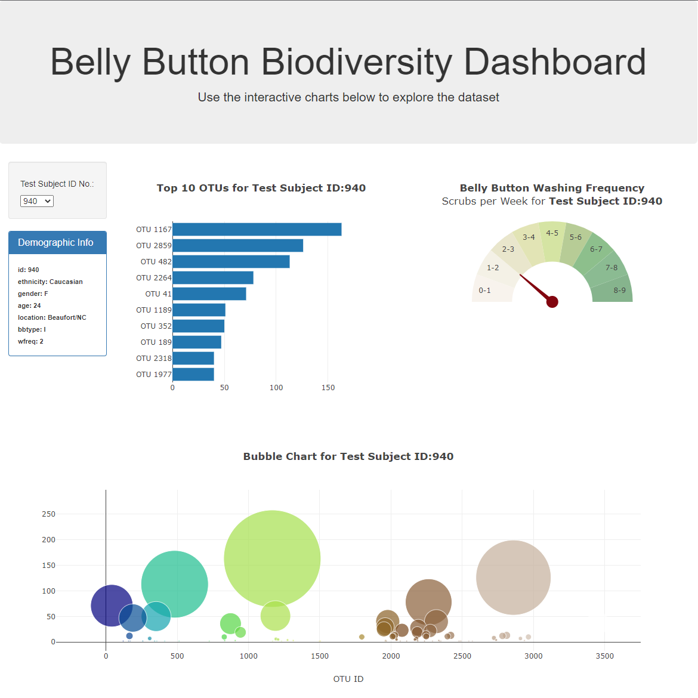

# plot.ly-challenge
Repo for Plot.ly challenge.

The index.html file at the root makes use of the data and js folders where the json data and javascript application logic reside.

Selecting a test subject id from the "Test Subject ID No.:" drop down list in the upper left will update all areas of the page which is comprised of 3 plots and an info section for demographic info.  The Bar and Bubble plots can be interacted with by hovering the mouse over a given bar or bubble to see the numeric value and text description associated with what is visualized.  The gauge plot depicts the wfreq value in the Demographic Info section for the test subject in relation to the range of frequency tracked overall.

